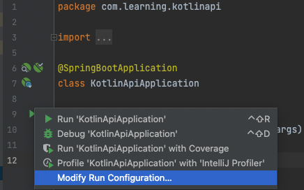
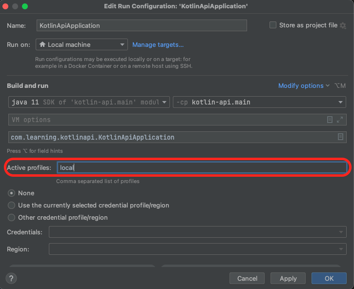

# Example Demo Project (Java and Kotlin - Spring Boot)

## Getting Started

###### Clone the repository
###### Configure Project in Intellij and Startup (Professional Recommended)

In the main `resources` folder, we can have multiple `application.yaml`. The `hyphen` separated files dictates the 
profile it is running on. If we are running the application locally, we might want to set the default profile as `local`.
```
- src 
    |- main
    |- kotlin [application source code]
    |- resources [resource required to run the application]
        |- application.yaml
        |- application-local.yaml
        |- application.test.yaml
```

In Intellij we can edit the run configuration for our app when starting it up locally.

1. Navigate to the Main.kt (`KotlinApiApplication.kt`)
```
- src  
    |-main
    |- kotlin [application source code]
        |- KotlinApiApplication.kt [main application file]
```
2. Change the run configuration and click apply





3. Start up the application

---

Run core:check using application-test.yaml
- `./gradlew core:bootrun -Dspring.profiles.active=local`
- `./gradlew core:bootrun -Dspring.profiles.active=default`
- `./gradlew core:check -Dspring.profiles.active=test`

---

### Terraform

In this repo, we are introducing api and terraform in the same repo

We are enhancing this using CI - github workflows
